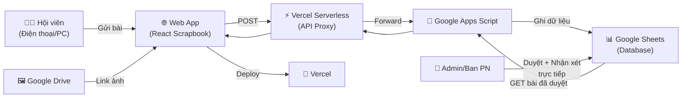

# 📋 KẾ HOẠCH TRIỂN KHAI DỰ ÁN SỐ HOÁ "NHẬT KÝ 3 NHẤT"

**Đơn vị:** Hội Phụ nữ Công an tỉnh Phú Thọ  
**Phụ trách dự án:** Đ/c Vi Ngọc Phương  
**Công nghệ:** React + Vite + CSS | Google Sheets + Apps Script | Vercel  
**Dự án:** Viết mới hoàn toàn  

---

## Bối cảnh

**"Nhật ký 3 Nhất"** là phong trào thi đua của Hội Phụ nữ Công an, tập trung vào tinh thần **"Tự soi, tự sửa và tự rèn luyện"** — ghi lại câu chuyện, việc làm hằng ngày của nữ chiến sĩ CAND gắn liền với tinh thần **Kỷ luật nhất – Trung thành nhất – Gần dân nhất**.

Dự án số hóa cuốn sổ nhật ký truyền thống thành **ứng dụng web phong cách Scrapbook** — người dùng có cảm giác đang lật giở từng trang giấy thật, xem từng bức ảnh kỷ niệm được dán trên đó.

---

## Triết lý thiết kế

> **Phong cách:** Sổ lưu niệm (Scrapbook) điện tử kết hợp hiệu ứng 3D tả thực  
> **Cảm xúc:** Trang trọng, tự hào (CAND) nhưng vẫn lãng mạn, thanh lịch, giàu cảm xúc  
> **Trải nghiệm:** Tối giản thao tác — cảm giác như lật giở từng trang giấy thật

---

## Kiến trúc hệ thống



---

## Cấu trúc Database (Google Sheets)

> [!NOTE]
> Đơn giản hóa so với bản cũ. Ảnh bìa do Admin tự thiết kế, không cần trong form.

| Cột | Header | Mô tả | Ví dụ |
|-----|--------|-------|-------|
| A | `timestamp` | Thời gian gửi (tự động) | `06/04/2026 22:45:00` |
| B | `hoTen` | Họ và tên | `Nguyễn Thị Lan` |
| C | `donVi` | Đơn vị (tự nhập) | `Phòng Cảnh sát hình sự` |
| D | `tieuDe` | Tiêu đề bài viết | `Một ngày cùng bà con bản Mường` |
| E | `tieuChi` | Tiêu chí 3 Nhất | `Gần dân nhất` |
| F | `noiDung` | Nội dung câu chuyện | *(text dài)* |
| G | `linkAnh` | Link ảnh (Google Drive) | `https://drive.google.com/...` |
| H | `trangThai` | Trạng thái | `Chờ duyệt` / `Đã duyệt` |
| I | `nhanXet` | Nhận xét của Ban Phụ nữ | `Bài viết rất cảm động...` |

---

## Bảng màu & Typography

| Thành phần | Giá trị | Mô tả |
|-----------|---------|-------|
| **Bìa sổ** | `#FF4747` (Cherry Red) | Đỏ Cherry rực rỡ, nhiệt huyết tuổi trẻ |
| **Chữ & hoạ tiết bìa** | `#F7E998` (Butter Yellow) | Vàng bơ hoàng gia, tương phản sang trọng |
| **Nền trang giấy** | `#E6E2D3` | Màu kem giấy cổ |
| **Chữ nội dung** | `#292524` (Stone-800) | Xám đen dịu mắt |
| **Font tiêu đề/nội dung** | Georgia / Times New Roman (Serif) | Cảm giác "văn bản cổ điển" |
| **Font UI/nút bấm** | Inter / Roboto (Sans-serif) | Sắc nét, hiện đại |

---

## GIAI ĐOẠN 1: CHUẨN BỊ DATABASE

### Task 1.1: Tạo Google Sheets

**Thực hiện thủ công:**

| Bước | Hành động |
|------|-----------|
| 1 | Truy cập [Google Drive](https://drive.google.com) |
| 2 | Tạo Google Sheets mới, đặt tên: `Data_NhatKy3Nhat_HPN` |
| 3 | Tạo headers Row 1: `timestamp`, `hoTen`, `donVi`, `tieuDe`, `tieuChi`, `noiDung`, `linkAnh`, `trangThai`, `nhanXet` |

---

### Task 1.2: Viết Google Apps Script (API)

**Prompt:**

```
Viết mã Google Apps Script cho Google Sheets "Data_NhatKy3Nhat_HPN"
(dự án Nhật ký 3 Nhất — Hội Phụ nữ Công an tỉnh Phú Thọ):

1. HÀM doPost(e):
   - Nhận JSON từ POST request
   - Tự động ghi timestamp (ngày giờ Việt Nam, GMT+7)
   - Ghi các trường: hoTen, donVi, tieuDe, tieuChi, noiDung, linkAnh
   - Mặc định: trangThai = "Chờ duyệt", nhanXet = "" (trống)
   - Xử lý CORS headers
   - Trả về JSON: { success: true, message: "Gửi thành công!" }

2. HÀM doGet(e):
   - Đọc toàn bộ dữ liệu từ Sheet
   - CHỈ trả về các hàng có trangThai = "Đã duyệt"
   - Trả về JSON array với đầy đủ các trường (bao gồm cả nhanXet)
   - Xử lý CORS headers

3. XỬ LÝ LỖI:
   - Try-catch cho cả doPost và doGet
   - Log lỗi vào Logger
   - Trả về error message rõ ràng

Sheet name: "Sheet1" (mặc định).
```

**Triển khai:**

| Bước | Hành động |
|------|-----------|
| 1 | Mở Google Sheets → **Tiện ích mở rộng** → **Apps Script** |
| 2 | Xóa code mặc định, dán code AI tạo vào |
| 3 | **Triển khai** → **Triển khai mới** |
| 4 | Loại: **Ứng dụng Web** / Quyền: **Bất kỳ ai** |
| 5 | Copy URL Web App → lưu cẩn thận |

> [!WARNING]
> URL Web App sẽ được ẩn bằng Vercel Serverless Function. Không hardcode trong frontend!

---

### Task 1.3: Test API

```
Test bằng trình duyệt/curl:
1. GET URL → trả về [] (mảng rỗng, chưa có bài đã duyệt)
2. POST với body mẫu:
   { "hoTen": "Test", "donVi": "Phòng CSHS", "tieuDe": "Test bài",
     "tieuChi": "Gần dân nhất", "noiDung": "Nội dung test...", "linkAnh": "" }
3. Kiểm tra Sheets → dữ liệu vào đúng cột
4. Đổi trangThai → "Đã duyệt" → GET lại → phải trả về bài
```

---

## GIAI ĐOẠN 2: XÂY DỰNG GIAO DIỆN SCRAPBOOK

### Task 2.1: Khởi tạo dự án

**Prompt:**

```
Khởi tạo dự án React trong thư mục d:\Code\nhat-ky-3-nhat:
- Vite + React + JavaScript (KHÔNG dùng TypeScript)
- Vanilla CSS (KHÔNG dùng Tailwind)
- Cài đặt: lucide-react, framer-motion
- Cấu trúc:
  src/
    components/     # UI components
    hooks/          # Custom hooks
    utils/          # Hàm tiện ích
    assets/         # logo.png và ảnh khác
    App.jsx
    main.jsx
    index.css       # Design system CSS variables + styles
```

**Lệnh:**

```bash
npx -y create-vite@latest ./ --template react
npm install
npm install lucide-react framer-motion
```

> [!IMPORTANT]
> File `logo.png` (logo Hội Phụ nữ Công an) đã có sẵn tại root project. Copy vào `src/assets/logo.png` khi khởi tạo.

---

### Task 2.2: Design System (index.css)

**Prompt:**

```
Tạo file index.css làm design system cho ứng dụng "Nhật ký 3 Nhất" phong cách Scrapbook:

CSS VARIABLES:
- --cherry-red: #FF4747 (bìa sổ)
- --butter-yellow: #F7E998 (chữ/hoạ tiết bìa)
- --paper-cream: #E6E2D3 (nền trang giấy)
- --text-dark: #292524 (chữ nội dung)
- --shadow-book: phức hợp shadow tạo khối sách 3D

STYLES CẦN CÓ:
1. Reset & base styles
2. Google Font: import Georgia (serif), Inter (sans-serif)
3. Leather texture overlay cho bìa (dùng CSS gradient/pattern tạo vân da mờ)
4. Page paper effect (giấy cổ, viền nhòe nhẹ)
5. Animation classes: page-flip, slide-in, fade-in
6. Responsive breakpoints: mobile (<768px), tablet, desktop
7. Typography scale cho Serif headings + Sans-serif UI
8. Button styles: Cherry Red nền + Butter Yellow chữ
```

---

### Task 2.3: Component — BookCover (Bìa sổ)

**Prompt:**

```
Tạo component BookCover.jsx — Bìa cuốn sổ nhật ký 3 Nhất.

THIẾT KẾ:
- Nền Cherry Red (#FF4747) có phủ lớp VÂN DA MỜ (leather texture) bằng CSS
- Bố cục từ trên xuống:
  1. Logo Hội Phụ nữ Công an (import từ src/assets/logo.png)
  2. Dòng chữ nhỏ in hoa: "CÔNG AN TỈNH PHÚ THỌ"
  3. Dòng nhỏ hơn: "Hội Phụ nữ"
  4. Tiêu đề chính: "Nhật ký" (font Serif vừa) + "BA NHẤT" (cỡ khổng lồ, in hoa, đậm)
     — Tất cả màu Butter Yellow #F7E998, có DROP-SHADOW tạo chữ nổi 3D
  5. Nút "MỞ SỔ NHẬT KÝ": gradient vàng bơ, chữ Cherry Red, bo tròn

HIỆU ỨNG:
- Toàn bộ bìa có đổ bóng sâu tạo cảm giác cuốn sách 3D
- Hover nút → scale nhẹ, glow
- Animation entrance: fade-in + slight scale khi load trang

RESPONSIVE:
- Desktop: Bìa chiếm ~60% chiều rộng, canh giữa
- Mobile: Full width, padding phù hợp
```

---

### Task 2.4: Component — ScrapbookPage (Trang nhật ký)

**Prompt:**

```
Tạo component ScrapbookPage.jsx — Hiển thị 1 bài nhật ký dạng trang scrapbook.

THIẾT KẾ:
- Mỗi trang hiển thị trọn vẹn 1 bài viết
- HÌNH NỀN: Nếu có linkAnh → ảnh phóng to phủ kín trang giấy
  Nếu không có ảnh → nền giấy kem #E6E2D3 với hoạ tiết vintage nhẹ
- LỚP PHỦ (overlay): Gradient từ đen (dưới) → trong suốt (trên)
  để chữ luôn đọc rõ dù ảnh nền sáng/tối

NỘI DUNG TRÊN TRANG:
- Góc trên: "NHẬT KÝ BA NHẤT" + badge tiêu chí (VD: "Gần dân nhất")
- Tiêu đề bài viết (font Serif lớn, màu sáng)
- Nội dung câu chuyện: font Serif, text-justify, chữ sáng
- Góc dưới: Tên tác giả + Đơn vị + Ngày viết
- Nếu có nhanXet (nhận xét Ban Phụ nữ): Hiển thị khung quote đẹp
  "📝 Nhận xét: ..." với style italic, viền trái vàng

RESPONSIVE:
- Desktop: Trang giấy tỷ lệ A4/sách, canh giữa, có shadow
- Mobile: Full width, padding tối ưu cho đọc trên điện thoại

Props: { entry } — object chứa toàn bộ data bài viết
```

---

### Task 2.5: Component — PageFlipper (Bộ lật trang)

**Prompt:**

```
Tạo component PageFlipper.jsx — Quản lý việc lật qua lại giữa các trang nhật ký.

CHỨC NĂNG:
- Nhận props: entries[] (danh sách bài đã duyệt)
- State: currentPage (index trang hiện tại)
- Render ScrapbookPage cho entry tại currentPage

TƯƠNG TÁC LẬT TRANG:
- 2 nút mũi tên mờ (< >) ở 2 mép cuốn sổ
- Desktop: Click nút để lật
- Mobile: Hỗ trợ SWIPE (vuốt trái/phải) bằng touch events
- Hiệu ứng lật trang: CSS animation giống lật giấy thật
  (có thể dùng framer-motion AnimatePresence)

HIỂN THỊ:
- Desktop (màn hình ngang): Hiển thị 2 trang mở bung (trang trái + trang phải)
  + Đổ bóng lõm ở gáy sách giữa màn hình
  + Lật 1 lần = qua 2 bài
- Mobile (màn hình dọc): CHỈ 1 trang
  + Loại bỏ gáy sách
  + Trải nghiệm giống xem Story (lật từng trang)

CHỈ SỐ TRANG: "Trang 3/15" nhỏ gọn ở góc dưới
```

---

### Task 2.6: Component — TableOfContents (Mục lục)

**Prompt:**

```
Tạo component TableOfContents.jsx — Sidebar mục lục & tìm kiếm.

VỊ TRÍ: Nút "📑 Mục lục" góc trên bên phải giao diện sổ.

KHI BẤM: Sidebar/Drawer trượt ra từ mép phải màn hình.

THÀNH PHẦN:
1. Thanh tìm kiếm (Search bar) có icon kính lúp
   - Real-time filtering khi nhập text
   - Tìm theo: tên tác giả, tiêu đề, nội dung, đơn vị

2. Danh sách bài viết: Card nhỏ gọn gồm:
   - Tiêu đề bài
   - Thời gian gửi
   - Đơn vị  
   - 1 dòng trích dẫn nội dung (cắt ngắn)
   - Badge tiêu chí (màu riêng)

3. Tương tác:
   - Click vào card → Sidebar đóng lại → Sổ NHẢY (jump) đến đúng trang
   - Animation đóng/mở mượt mà
   - Overlay backdrop mờ phía sau

RESPONSIVE: Full height trên cả mobile và desktop.
```

---

### Task 2.7: Component — SubmitForm (Viết trang mới)

**Prompt:**

```
Tạo component SubmitForm.jsx — Form gửi bài nhật ký mới.

TRẢI NGHIỆM: Khi bấm "✍️ Viết trang mới", một trang giấy kem #E6E2D3
trượt đè lên trang hiện tại (animation slide-in).

FORM TỐI GIẢN:
1. Họ và tên (text input, bắt buộc)
2. Đơn vị (text input, tự nhập, bắt buộc)
3. Tiêu đề bài viết (text input, bắt buộc)
4. Tiêu chí 3 Nhất (radio buttons):
   - Kỷ luật nhất
   - Trung thành nhất
   - Gần dân nhất
5. Nội dung câu chuyện (textarea lớn, bắt buộc, min 50 ký tự)
6. Link ảnh (text input, paste link Google Drive, optional)
   - Tự động chuyển đổi link Drive: 
     /file/d/[ID]/view → https://lh3.googleusercontent.com/d/[ID]
   - Hiển thị preview ảnh nhỏ sau khi dán link

NÚT GỬI: "Gửi lưu bút" — nền Cherry Red, chữ Butter Yellow, to rõ

XỬ LÝ SUBMIT:
- POST đến /api/sheets (Vercel serverless proxy)
- Loading: "⏳ Đang gửi bài viết..."
- Thành công: "✅ Gửi thành công! Bài viết đang chờ phê duyệt."
- Lỗi: "❌ Có lỗi xảy ra. Vui lòng thử lại."
- Reset form sau khi thành công

VALIDATION: Tiếng Việt, inline error messages

STYLE: Font UI (Inter/sans-serif), input gọn gàng trên nền giấy kem
```

---

### Task 2.8: Hooks & Utils (Kết nối API)

**Prompt:**

```
Tạo các file utility và custom hooks:

1. src/utils/api.js:
   - Base URL: "/api/sheets"
   - fetchEntries(): GET → trả về entries[]
   - submitEntry(data): POST → trả về result
   - Error handling rõ ràng

2. src/utils/driveHelper.js:
   - convertDriveLink(url):
     Input: https://drive.google.com/file/d/[ID]/view?usp=sharing
     Output: https://lh3.googleusercontent.com/d/[ID]
     (Dùng lh3.googleusercontent.com vì ổn định hơn /uc?export)
   - isValidDriveLink(url): Kiểm tra link Drive hợp lệ

3. src/hooks/useDiaryEntries.js:
   - Fetch danh sách bài đã duyệt
   - State: entries[], loading, error
   - Auto-refresh mỗi 5 phút

4. src/hooks/useSubmitEntry.js:
   - Gửi bài viết mới
   - State: submitting, success, error
   - Reset state sau 3 giây
```

---

### Task 2.9: Tổ hợp App.jsx

**Prompt:**

```
Tổ hợp toàn bộ components vào App.jsx:

FLOW CHÍNH:
1. Khởi tạo: Loading spinner → Fetch entries từ API
2. Màn hình đầu tiên: BookCover (bìa sổ)
3. Bấm "MỞ SỔ NHẬT KÝ" → Animation mở sổ → PageFlipper hiển thị
4. Trong mode đọc sổ:
   - PageFlipper render các ScrapbookPage
   - Nút "📑 Mục lục" góc trên phải → mở TableOfContents
   - Nút "✍️ Viết trang mới" → mở SubmitForm trên nền giấy
   - Nút "📕 Gập sổ" → quay về BookCover

STATE:
- viewMode: "cover" | "reading" | "writing"
- currentPage: number
- entries: [] (từ useDiaryEntries hook)
- showTOC: boolean (toggle sidebar mục lục)

EMPTY STATE: Nếu chưa có bài viết nào đã duyệt:
"Cuốn sổ chưa có trang nào. Hãy là người đầu tiên viết lưu bút! ✍️"

RESPONSIVE:
- Desktop: Sổ mở bung 2 trang, các nút nằm ngoài cuốn sổ
- Mobile: 1 trang, nút thu nhỏ dàn hàng ngang trên nắp sổ
```

---

## GIAI ĐOẠN 3: BẢO MẬT & XỬ LÝ ẢNH

### Task 3.1: Vercel Serverless Function (API Proxy)

**Prompt:**

```
Tạo Vercel Serverless Function tại api/sheets.js:

Mục đích: Ẩn URL Google Apps Script khỏi frontend.

1. Environment variable: GAS_API_URL
2. GET request → forward tới GAS_API_URL → trả về JSON
3. POST request → forward body tới GAS_API_URL → trả về response
4. CORS headers
5. Error handling + timeout 30s
6. vercel.json cấu hình phù hợp
```

---

### Task 3.2: Xử lý link ảnh Google Drive

Đã tích hợp trong Task 2.8 (driveHelper.js). Logic:

- Link Drive thông thường → trích xuất ID bằng Regex → chuyển thành `lh3.googleusercontent.com/d/[ID]`
- Ảnh phải được set quyền **"Bất kỳ ai có liên kết đều có thể xem"** trên Drive

---

## GIAI ĐOẠN 4: KIỂM THỬ & DEPLOY

### Task 4.1: Kiểm thử nội bộ

| # | Hạng mục | Kiểm tra |
|---|----------|----------|
| 1 | Bìa sổ | Hiển thị đúng: logo, tên đơn vị, tiêu đề, nút mở sổ |
| 2 | Form gửi bài | Nhập 2-3 bài thử, dữ liệu vào đúng cột Sheets |
| 3 | Trạng thái | Mặc định "Chờ duyệt", nhanXet trống |
| 4 | Duyệt bài | Đổi trạng thái trong Sheets → bài hiện trên web |
| 5 | Nhận xét | Thêm nhận xét trong Sheets → hiện trên trang bài viết |
| 6 | Lật trang | Desktop: 2 trang + gáy sách / Mobile: 1 trang + swipe |
| 7 | Mục lục | Tìm kiếm, jump đến đúng trang |
| 8 | Ảnh Drive | Link ảnh Google Drive hiển thị chính xác |
| 9 | Responsive | Đẹp trên điện thoại (ưu tiên) và desktop |
| 10 | Tốc độ | Trang load < 3 giây |

---

### Task 4.2: Deploy Vercel

| Bước | Hành động |
|------|-----------|
| 1 | Push code lên GitHub |
| 2 | Vào vercel.com → Import repository |
| 3 | Framework: **Vite** / Build: `npm run build` / Output: `dist` |
| 4 | Env vars: `GAS_API_URL` = URL Google Apps Script |
| 5 | Deploy → kiểm tra |
| 6 | Cấu hình domain tùy chỉnh (anh tự làm trên Vercel) |

---

### Task 4.3: SEO & Meta tags

**Prompt:**

```
Tối ưu index.html:
- Title: "Nhật ký 3 Nhất | Hội Phụ nữ Công an tỉnh Phú Thọ"
- Meta description: Mô tả phong trào
- Open Graph tags: Chia sẻ đẹp trên Facebook/Zalo
- Favicon: Tạo từ logo.png
- Font preload: Georgia, Inter
```

---

## Verification Plan

### Automated

- `npm run build` thành công không lỗi
- API GET/POST hoạt động đúng
- Lighthouse ≥ 85 (Performance, Accessibility)

### Manual

- Nhập 3 bài viết qua form → duyệt trên Sheets → hiển thị trên web
- Test trên: Chrome Desktop, Chrome Mobile, Safari Mobile
- Lật trang mượt mà trên cả desktop (2 trang) và mobile (1 trang)
- Test chia sẻ link qua Zalo/Facebook (OG preview)

---

## Timeline

| Giai đoạn | Thời gian | Trạng thái |
|-----------|-----------|-----------|
| GĐ 1: Database (Sheets + Apps Script) | 1-2 giờ | ⬜ Chưa bắt đầu |
| GĐ 2: Frontend Scrapbook (8 tasks) | 6-8 giờ | ⬜ Chưa bắt đầu |
| GĐ 3: Bảo mật API Proxy | 1 giờ | ⬜ Chưa bắt đầu |
| GĐ 4: Kiểm thử + Deploy | 1-2 giờ | ⬜ Chưa bắt đầu |
| **Tổng cộng** | **~9-13 giờ** | |
Địa chỉ Github: <https://github.com/vi-phuong-158/nhatky3nhat_pt>
